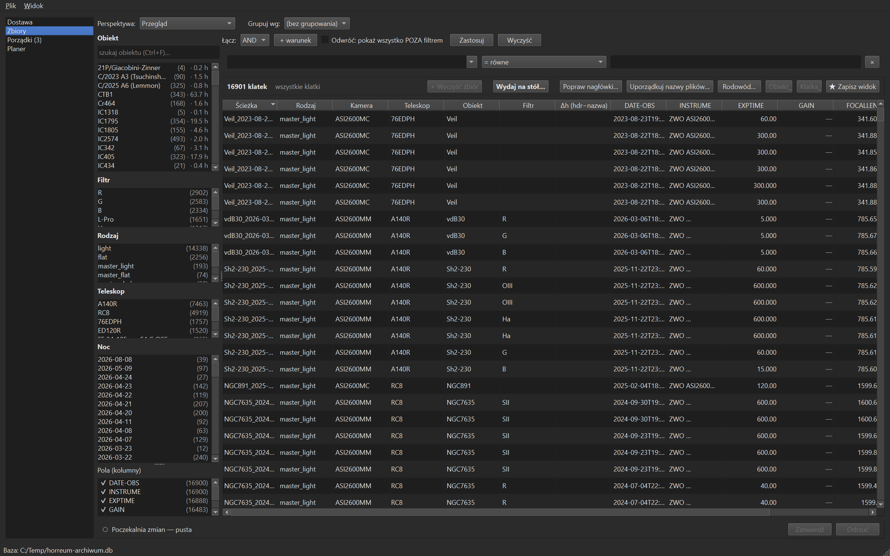

# Horreum

**English** · [Polski](#horreum-po-polsku)

Standalone catalog manager for a deep‑sky astrophotography library (light frames and masters),
working over any file tree.



*The Collections view — faceted axes (object, filter, kind, telescope, night) over the whole archive, dark theme.*

Horreum inverts the classic *"folder = truth"* model: a **SQLite database is the authority**, and a
file's **`sha1` content hash is its identity** — surviving renames and moves. Every identity change is
an appended event, never a destructive update, so you get full history and time‑travel out of the box.
Scanning only **reads** your files — it never moves, renames, or deletes them.

Horreum derives the axes you actually search by — **telescope**, **observing site** (from GPS in the
header), and **object** (Messier / Caldwell → NGC / IC cross‑catalogs, common names, Solar‑System
bodies) — straight from FITS/XISF headers, independent of how your folders are arranged.

**Who it's for:** astrophotographers who want one queryable catalog over a large FITS/XISF archive.

**Status:** early development — schema and API may still change. The desktop UI ships in **English and
Polish** (switchable at startup); the documentation is Polish, and the full guide is in the sections
below.

**Download (Windows):** a **single portable `.exe`** — no installer, no unpacking — on the
[Releases](../../releases/latest) page.

**Contributing:** a hobby project maintained in spare time — issues and pull requests are welcome, but
responses may take a while (that's expected, not neglect). See [CONTRIBUTING.md](CONTRIBUTING.md) and
[CHANGELOG.md](CHANGELOG.md).

---

## Horreum (po polsku)

Samodzielny menedżer biblioteki astrofotograficznej (suby i mastery) dla dowolnego drzewa plików.


*Widok „Zbiory" — osie-facety (obiekt, filtr, rodzaj, teleskop, noc) nad całym archiwum; motyw ciemny.*

> **Status:** wczesny rozwój. Schemat i API mogą się jeszcze zmieniać.
>
> **Nowy użytkownik?** Instrukcja krok po kroku (zakładanie bazy, pierwsza konfiguracja, obsługa):
> [doc/instrukcja.md](doc/instrukcja.md).

## Filozofia: baza = autorytet

Horreum odwraca klasyczny model „folder = prawda". Tutaj:

- **Baza danych jest autorytetem.** Pliki to zamrożony, append-only zimny magazyn. Foldery (np. drzewa wejściowe do WBPP) to jednorazowe projekcje generowane na żądanie z zapytania.
- **`sha1` = tożsamość pliku** — przeżywa zmianę nazwy i przeniesienie. Ścieżka to atrybut lokalizacji, nie tożsamość. Jeden plik (jedna zawartość) może mieć wiele lokalizacji.
- **Każda zmiana tożsamości to dopisanie zdarzenia** (append-only `event`), nigdy destrukcyjny update. Pełna historia i podróż w czasie z pudełka.
- **Jedyne drzwi do zapisu** — pojedyncza warstwa repozytorium emitująca zdarzenia, pilnowana meta-testem. Relacje (kalibracja, lineage masterów) są jawne, nie wyprowadzane z parsowania nazw plików.

## Wbudowany resolver tożsamości

Horreum rozpoznaje obiekty niezależnie od zapisu w nagłówku: katalogi krzyżowe (Messier / Caldwell → NGC / IC, polityka NGC-wins), nazwy potoczne oraz fakt sprzętowy kamery (np. warianty ZWO ASI2600). Działa na czystym drzewie każdego użytkownika, bez zależności od żadnego zewnętrznego narzędzia.

**Rozpoznane i nierozpoznane wyglądają inaczej - i to jest celowe.** Kolumna „Obiekt" w Zbiorach
niesie pięć różnych odpowiedzi i każda ma własny znacznik oraz własną receptę: nazwa bez znacznika
to obiekt rozpoznany, `↺` to nazwa zdjęta ręką (z pamięcią, CO zdjęto - da się przywrócić), `?` to
nazwa, której resolver nie rozpoznał (jedyny stan, który jest robotą), `⟨…⟩` to niepotwierdzona
propozycja z nazwy folderu, a wygaszony szary wiersz to klatka kalibracyjna, która obiektu nie ma
z definicji. Pusta komórka znaczy „plik nie mówi nic i program niczego nie zgaduje". Tabela
„co widzisz - co to znaczy - co z tym zrobić" jest w [instrukcji](doc/instrukcja.md#co-mówi-kolumna-obiekt).

## Stos technologiczny

Python 3.9+ · PySide6 (GUI desktop) · SQLite · astropy (czytnik nagłówków FITS). Rdzeń bazy jest
bez zależności zewnętrznych (stdlib); astropy wchodzi dopiero na etapie skanu.

## Instalacja i uruchomienie

### Wersja zamrożona (Windows, bez Pythona)

**⬇ [Pobierz najnowszą wersję](../../releases/latest)** — w sekcji „Assets" jest **jeden plik**:
**`Horreum-<wersja>-windows-x64.exe`**.

Nic nie instalujesz i nic nie rozpakowujesz: zapisz plik gdziekolwiek (pulpit, pendrive) i uruchom
dwuklikiem. Cała aplikacja siedzi w tym jednym pliku. Numer wersji sprawdzisz w **tytule okna**.

> Przy pierwszym uruchomieniu Windows może ostrzec, że to nieznana aplikacja — to normalne dla
> programów spoza sklepu. Wybierz **Więcej informacji → Uruchom mimo to**. Start z jednego pliku
> trwa kilka sekund dłużej niż zwykle (aplikacja rozpakowuje się do pamięci) — okno pojawia się
> od razu i mówi, co robi.

Baza to plik `.db`, który wybierasz w aplikacji; nie jest przywiązana do katalogu programu.
Instrukcja krok po kroku: [doc/instrukcja.md](doc/instrukcja.md).

### Ze źródła (dowolny system)

```bash
pip install -e ".[gui]"
python -m horreum.gui        # aplikacja okienkowa
horreum --help               # linia poleceń
```

## Szybki start

1. **Nowa baza** — wskaż plik `.db` (pusty powstanie z migracjami).
2. **Skanuj** drzewo z plikami FITS/XISF/RAW — baza wciąga nagłówki (append-only, `sha1` = tożsamość).
3. **Grupuj** — Horreum wyprowadza osie teleskopu i konfiguracji.
4. **Rozwiąż** — resolver rozpoznaje obiekty (katalogi krzyżowe, nazwy potoczne, ciała Układu,
   regiony po współrzędnych, propozycje z nazwy folderu).
5. **Przegląd** — co wymaga ręcznej decyzji, trafia na listę. Stamtąd nazwiesz klatki ręką,
   potwierdzisz propozycję z folderu albo dopiszesz kartę `OBJECT` wprost do pliku; każdą własną
   decyzję da się cofnąć. Kopia, której nie dało się odczytać, mówi, co zawiodło: dysk (dostęp),
   plik (nagłówek) czy program (baza).

Poza tą drogą: **Stosy** (gotowe obrazy po integracji wchodzą do biblioteki razem z rodowodem —
z czego powstały), **Planer** (co warto sfotografować dziś, z pokryciem materiału), **Wydaj na
stół** (drzewo linków/kopii pod WBPP) i **Uporządkuj nazwy plików** (zmiana nazw z faktów
nagłówka — z podglądem i cofnięciem).

## Budowanie wersji zamrożonej

Wymaga Windows + Pythona. Build idzie z czystego, izolowanego środowiska (`.venv-build`) —
skrypt tworzy je sam:

```powershell
powershell -ExecutionPolicy Bypass -File packaging\build.ps1 -Onefile   # artefakt wydania
powershell -ExecutionPolicy Bypass -File packaging\build.ps1           # onedir (dev)
```

`-Onefile` daje **jeden plik** `dist\horreum-gui.exe` — to jest artefakt publikowany w Releases.
Build sam sprawdza, czy zamrożony plik naprawdę wstaje i czy niesie właściwy numer wersji: uruchamia
go i czyta **tytuł okna procesu potomnego** (bootloader jednego pliku sam tytułu nie ma). Numer ma
jednego właściciela — `pyproject.toml`; pilnuje tego `tests/test_version.py`.

Szczegóły decyzji pakietowania — `packaging\horreum-onefile.spec` (i `packaging\horreum.spec`
dla wariantu katalogowego).

## Licencja

MIT — zobacz [LICENSE](LICENSE).
